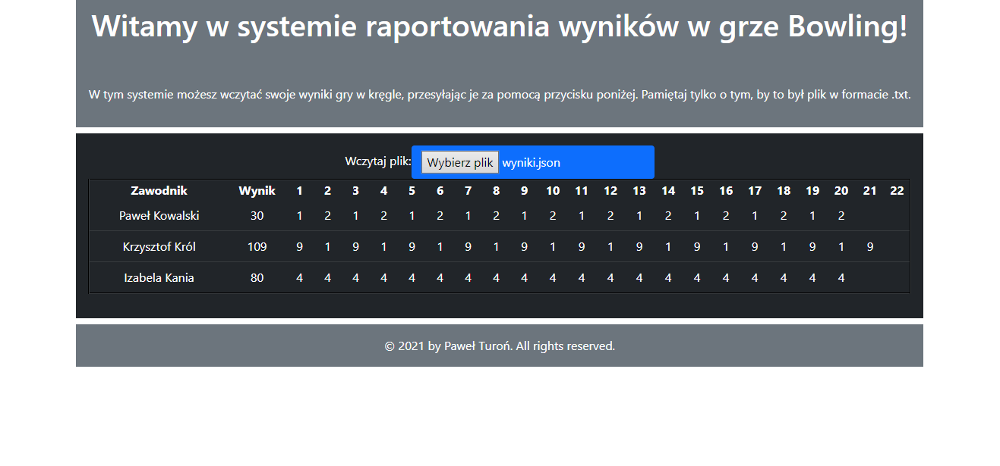

# Bowling

## What's new?

There is no new features.

## About project

Bowling page example below.

## Technologies used in the project

* Angular 12
* jQuery
* Bootstrap 4

## Goals

Main goal is to learn Angular framework by reading text files and filling a table with data.

## License

My project is under BSD-2-Clause license. You can use some parts from my code but remember to credit me as an
appreciation to my work! Thanks! Awoo!

© 2022 Paweł "Wilczeq/Vlk" Turoń
